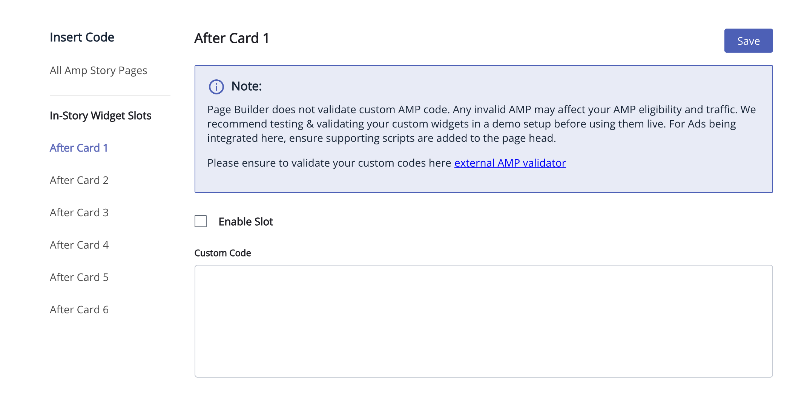

# AMP Widgets Configuration

AMP widgets can be configured in two ways: through the Page Builder (PB) UI or via custom configuration for publishers.

- Custom widgets can be inserted up to 6 slots (after story cards 1–6).
- If a story has fewer than X cards, that slot is simply ignored (the AMP code is not rendered).
- Widgets provide flexibility to add any AMP-compliant component type. The AMP Library does not validate code, so you must ensure your widget code is AMP-compliant. Invalid tags can cause unpredictable behavior (e.g., ads not displaying).
  - _Example_: If a publisher adds `amp-sticky-ad` in the widget but forgets to add the required script in the head, the widget will be rendered but the ad will not load.
- BOLD ads (Header, Footer, and Body-Ad) will coexist with the newly added custom ads/widgets.
- Page Builder does not provide a preview for AMP ads.
- The AMP library itself doesn't restrict the number of ads. However, the ad provider may choose not to serve multiple creatives.

## Page Builder Configuration

Page Builder provides an option to configure widgets directly through the UI. This is the standard way to manage widgets for stories.



## Custom Publisher Configuration

For custom publishers, you can provide the widget configuration through `ampConfig` in your `ampRoutes` setup. This allows for dynamic or code-based widget definitions.

### Example Configuration

You can pass `customAmpWidgets` function to the `ampRoutes` configuration. The getCustomWidgetsForAmpStory function should return an array of widget objects.

```javascript
ampRoutes(app, {
  getAdditionalConfig: additionalConfigGetter,
  enableAmp: (config) => get(config, ["pbConfig", "general", "amp", "amp-story-pages"], true),
  customAmpWidgets: getCustomWidgetsForAmpStory
  // ... other options
});
```

Below is a sample `customAmpWidgets` function:

```javascript
function getCustomWidgetsForAmpStory() {
  const customWidgets = [
    {
      "enable" : true,
      'code': `<amp-fx-flying-carpet height="300px">
                      <amp-ad width="300" height="600" layout="fixed"
                        type="doubleclick"
                        data-slot="/5463099287/PB-AMP-300x600"
                        data-loading-strategy="prefer-viewability-over-views">
                      </amp-ad>
                    </amp-fx-flying-carpet>`
    },
    {
      "enable" : true,
      'code': `<amp-ad
      width="300"
      height="200"
      layout="fixed"
      type="doubleclick"
      data-slot="/5463099287/PB-AMP-300x200"
      data-loading-strategy="prefer-viewability-over-views"></amp-ad>`
    },
   ....
  ];

  return customWidgets;
}
```

### Required Scripts

Ensure that you include the necessary AMP scripts in the `<head>` of your `layout.ejs` file for the components you are using.

```html
<script async custom-element="amp-ad" src="https://cdn.ampproject.org/v0/amp-ad-0.1.js"></script>
<script
  async
  custom-element="amp-fx-flying-carpet"
  src="https://cdn.ampproject.org/v0/amp-fx-flying-carpet-0.1.js"
></script>
```
